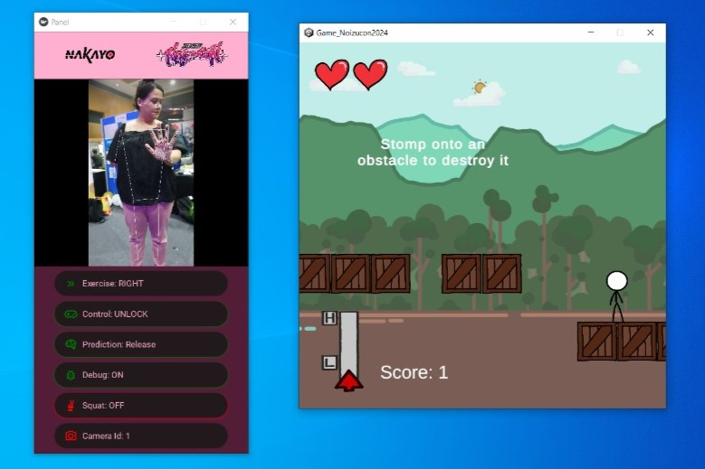

# NakFit @ Noizucon-2024

  

## What is this project about?

### NakFit

This is a video game project titled NakFit. The player need to control their in-game character to jump between platforms. Since this project is under Noizucon's health gaming label, a motion sensor input will be added later.

### Controls
Player need to hold the jump key (in early development, a space key) to fill up the force meter and release it when the meter reach their desired value. When the motion sensor implemented later, instead of the traditional key bind, player need to squat to fill up the meter and stand to release it.

### Objective

Player need to jump on next platform while avoiding enemies as well as collecting in-game points to gain score. Reach maximum number of score to clear the game. The player however can continue the game even after reaching the maximum score to record their highest score.

### Winning and Losing Conditions

1. Win: Successfully jump to next platform. Gain max score

2. Lose: Fail to jump onto the next platform and fall. Collide with enemies too many time and lose all health points.
  
## What is Noizucon?

Noizucon is an urban lifestyle convention. From the Noizucon <a href='https://www.noizu.asia/'>main page</a>:
<blockquote cite='https://www.noizu.asia/'>
  This event blends the essence of urban lifestyles with the vibrancy of youth. Dive into esports, creative cosplay, interactive workshops, tabletop games, and engaging discussions with industry experts. Explore cutting-edge trends in collectibles and immerse yourself in our curated "Young Urbanite Experience". Join us for a transformative journey where urban culture and youthful spirit harmonize in an unforgettable event!
</blockquote>

 
Below are the details of Noizucon 2024:

| Item | Description |
| --- | --- |
| Date | 13th September 2024 to 15th September 2024 |
| Day | Friday to Sunday |
| Venue | Dewan Tun Chancellor, MMU Cyberjaya |

<h2>Contributors</h2>

| Name | Contributions |
| --- | --- |
| Shazwan | Team leader, Backend developer |
| Iqbal | Lead game developer, UI Artist |
| Aisha | Machine learning engineer, Data analyst |
| Irfan | Machine learning engineer, UI Artist, Animator |
| Noizucon committees, Peers | Tester |
